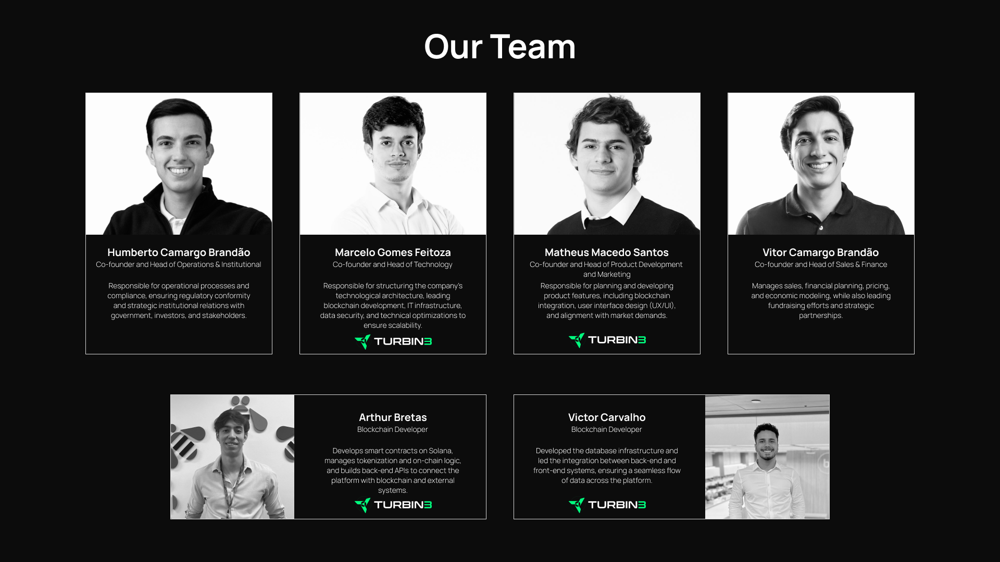

# CarbonPay Platform

CarbonPay is a decentralized platform for carbon credit tokenization, offsetting, and traceability built on the Solana blockchain. It enables organizations to offset their carbon footprint through verifiable, auditable, and transparent smart contracts — with metadata and certification securely stored via IPFS.


## 🌍 Project Overview

CarbonPay bridges Web3 infrastructure with real-world environmental assets. Our platform allows companies to:

- Onboard their organization using wallet-based authentication
- Browse tokenized carbon credit projects with full metadata
- Purchase and retire carbon credits on-chain using SOL
- Generate compliance-ready audit reports
- Provide public traceability of offsets through explorer-linked pages
- Track carbon credit projects lifecycle from creation to retirement

## 🔐 Security & Compliance

- Smart contracts audited internally before deployment
- All transactions are public and traceable via Solana Explorer
- No sensitive user data collected (wallet-based access)
- Metadata and documentation stored on decentralized IPFS
- Compatible with reporting requirements under voluntary markets

## 💼 Business Model & Value Proposition

### For Project Owners

- **Tokenization**: Convert verified carbon credits into tradeable tokens
- **Liquidity**: Access a global market of potential buyers
- **Transparency**: Build trust through blockchain-verified project data
- **Automated Payments**: Receive instant payments in SOL
- **Fee Structure**: 5% platform fee on transactions
- **Project Management**: Track project performance and offset status

### For Buyers

- **Verified Credits**: Access to certified carbon credits
- **Transparent Pricing**: Clear fee structure and pricing
- **Instant Settlement**: Blockchain-based immediate transactions
- **Traceability**: Full history of credit ownership and retirement
- **Compliance Ready**: Generate reports for regulatory requirements
- **Portfolio Management**: Track purchased and retired credits

### For Organizations

- **Carbon Neutrality**: Achieve sustainability goals
- **ESG Compliance**: Meet environmental reporting requirements
- **Public Verification**: Demonstrate commitment to sustainability
- **Automated Offsetting**: Set up recurring offset programs
- **Analytics**: Track carbon footprint and offset progress

### Revenue Streams

1. **Transaction Fees**: 5% fee on all credit purchases
2. **Premium Features**: Advanced analytics and reporting tools
3. **Enterprise Solutions**: Custom integration and support
4. **API Access**: Developer access to platform data

### Market Opportunity

- Growing demand for carbon credits
- Increasing corporate sustainability requirements
- Rising need for transparent offset verification
- Expanding ESG compliance requirements
- Growing Web3 adoption in traditional markets

### Competitive Advantages

1. **Blockchain Integration**: Full transparency and traceability
2. **Automated Processes**: Reduced administrative overhead
3. **Global Accessibility**: Borderless carbon credit trading
4. **Instant Settlement**: No traditional banking delays
5. **Smart Contract Security**: Automated compliance and verification

### Target Markets

1. **Corporations**: Large enterprises with sustainability goals
2. **Project Developers**: Carbon credit project owners
3. **ESG Investors**: Sustainable investment funds
4. **Governments**: Public sector sustainability initiatives
5. **Small Businesses**: Companies starting sustainability programs

### Growth Strategy

1. **Market Expansion**: Target key geographic regions
2. **Partnership Development**: Strategic alliances with sustainability organizations
3. **Product Development**: Continuous platform enhancement
4. **Community Building**: Engage with sustainability stakeholxders
5. **Regulatory Compliance**: Adapt to evolving carbon market regulations

## 🛠️ Technology Stack

### Frontend

- Next.js 14
- TypeScript
- Tailwind CSS
- Solana Web3.js
- Phantom Wallet Integration
- React Query
- Zustand (State Management)

### Backend

- Node.js
- TypeScript
- Express
- Prisma (ORM)
- PostgreSQL
- IPFS (via Infura)
- Anchor Framework Integration
- Jest + Supertest (Testing)

### Smart Contracts (Solana)

- Rust
- Anchor Framework 0.29.0
- SPL Token Program
- Token Metadata Program
- Custom PDAs for project and purchase tracking

### Infrastructure

- Docker
- Docker Compose
- PostgreSQL 13
- IPFS (Infura/Pinata)
- Solana Devnet/Mainnet

## 📊 Database Schema

### `wallets`

```sql
CREATE TABLE wallets (
    id SERIAL PRIMARY KEY,
    wallet_address VARCHAR(44) UNIQUE NOT NULL,
    provider VARCHAR(50) NOT NULL,
    role VARCHAR(20) NOT NULL,
    created_at TIMESTAMP DEFAULT CURRENT_TIMESTAMP
);
```

### `organizations`

```sql
CREATE TABLE organizations (
    id SERIAL PRIMARY KEY,
    wallet_id INTEGER REFERENCES wallets(id),
    company_name VARCHAR(255) NOT NULL,
    registration_number VARCHAR(50),
    sustainability_certifications TEXT[],
    tracks_emissions BOOLEAN DEFAULT false,
    emission_sources TEXT[],
    created_at TIMESTAMP DEFAULT CURRENT_TIMESTAMP
);
```

### `projects`

```sql
CREATE TABLE projects (
    id SERIAL PRIMARY KEY,
    owner_wallet_id INTEGER REFERENCES wallets(id),
    name VARCHAR(255) NOT NULL,
    description TEXT,
    total_credits BIGINT NOT NULL,
    price_per_token BIGINT NOT NULL,
    carbon_pay_fee INTEGER NOT NULL,
    nft_mint VARCHAR(44) NOT NULL,
    token_mint VARCHAR(44) NOT NULL,
    uri TEXT NOT NULL,
    status VARCHAR(20) DEFAULT 'active',
    created_at TIMESTAMP DEFAULT CURRENT_TIMESTAMP
);
```

### `purchases`

```sql
CREATE TABLE purchases (
    id SERIAL PRIMARY KEY,
    buyer_wallet_id INTEGER REFERENCES wallets(id),
    project_id INTEGER REFERENCES projects(id),
    amount BIGINT NOT NULL,
    remaining_amount BIGINT NOT NULL,
    nft_mint VARCHAR(44) NOT NULL,
    purchase_date TIMESTAMP DEFAULT CURRENT_TIMESTAMP
);
```

### `offset_requests`

```sql
CREATE TABLE offset_requests (
    id SERIAL PRIMARY KEY,
    purchase_id INTEGER REFERENCES purchases(id),
    amount BIGINT NOT NULL,
    request_id VARCHAR(255) UNIQUE NOT NULL,
    status VARCHAR(20) DEFAULT 'pending',
    request_date TIMESTAMP DEFAULT CURRENT_TIMESTAMP,
    processed_date TIMESTAMP,
    processor_wallet_id INTEGER REFERENCES wallets(id)
);
```

## 🔗 Smart Contract Architecture

### Core Programs

1. **CarbonCredits Program**

   - Global platform state
   - Fee management
   - Project tracking

2. **Project Program**

   - Project initialization
   - Token minting
   - Metadata management
   - Fee calculations

3. **Purchase Program**

   - Credit purchase handling
   - NFT minting
   - Payment processing

4. **Offset Program**
   - Offset request management
   - Token burning
   - Verification process

### Key PDAs

- `carbon_credits` - Global platform state
- `project` - Project-specific data
- `purchase` - Purchase records
- `offset_request` - Offset tracking

## 🚀 Getting Started

### Prerequisites

- Node.js 18+
- Rust 1.70+
- Solana CLI
- Docker & Docker Compose
- Anchor Framework

### Environment Setup

1. Clone the repository

```bash
git clone https://github.com/your-org/carbonpay-platform.git
cd carbonpay-platform
```

2. Create `.env` file

```env
SERVER_PORT=3000
POSTGRES_PORT=5432
NODE_ENV=development
```

3. Start the infrastructure

```bash
cd docker
docker-compose up -d
```

4. Install dependencies

```bash
# Backend
cd app/backend
npm install

# Frontend
cd app/frontend
npm install
```

5. Start development servers

```bash
# Backend
cd app/backend
npm run dev

# Frontend
cd app/frontend
npm run dev
```

## 🧪 Testing

### Smart Contract Tests

```bash
anchor test
```

### Backend Tests

```bash
cd app/backend
npm test
```

### Frontend Tests

```bash
cd app/frontend
npm test
```

## 📦 Deployment

### Smart Contracts

```bash
anchor build
anchor deploy
```

### Backend

```bash
cd app/backend
npm run build
docker-compose up -d backend
```

### Frontend

```bash
cd app/frontend
npm run build
docker-compose up -d frontend
```

## 🔍 Monitoring & Maintenance

- Solana Explorer integration for transaction tracking
- IPFS pinning service monitoring
- Database backup procedures
- Error tracking and logging

## 👥 Our Team



Our team combines expertise in blockchain, full-stack development, sales, finance, compliance, and law to build the future of carbon markets.

## 🌐 Connect With Us

- **Website**: [carbonpay.eco](https://carbonpay.eco)
- **Twitter**: [@carbonpayeco](https://x.com/carbonpayeco)

## 📜 License

MIT License – CarbonPay © 2024
