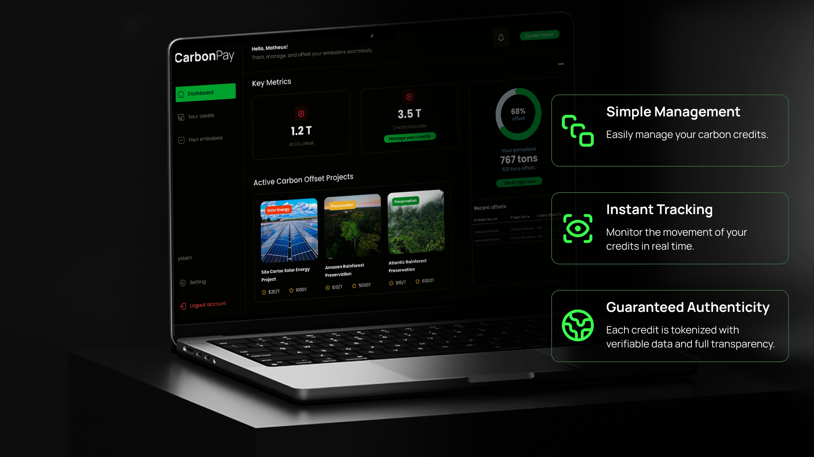
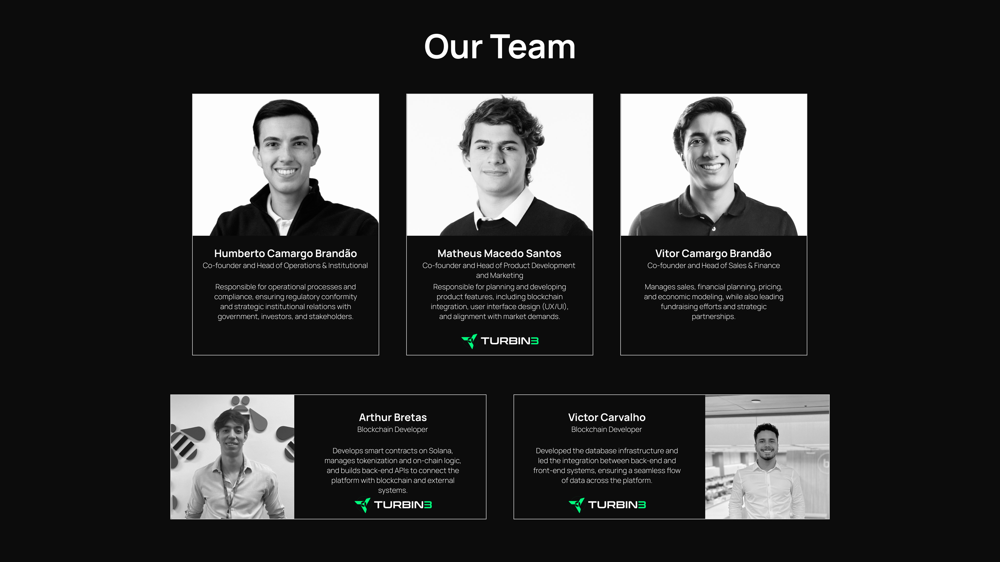

# CarbonPay Platform

CarbonPay is a platform that merges Web3 infrastructure with real-world environmental assets, creating a new way to tokenize, trade, and retire carbon credits. Built on the Solana blockchain, CarbonPay ensures full transparency, traceability, and global liquidity — with auditable smart contracts and documentation anchored via IPFS.



## 🌍 Project Overview

CarbonPay is the bridge between the digital economy and the voluntary carbon market. Our platform enables companies to:

- Register their organization through Solana wallet authentication
- Explore tokenized environmental projects with full metadata and certification
- Purchase and retire carbon credits directly on-chain
- Generate compliance-ready audit reports automatically
- Provide public traceability for each offset using explorer-linked data
- Monitor the entire lifecycle of carbon credit projects, from creation to retirement

## 🔐 Security & Compliance

CarbonPay is built with a strong focus on security, transparency, and alignment with voluntary market standards.

- Internal audits of all smart contracts before deployment
- On-chain transparency via Solana Explorer: all credit purchases, retirements, and transfers are public
- No sensitive user data is collected thanks to wallet-based access
- Metadata and certification documents are stored on IPFS for immutability
- Designed to meet global certification requirements (Verra, Gold Standard)

## 💼 Business Model and Value Proposition

### For Project Owners

- Tokenization of certified carbon credits into traceable SPL tokens
- Access to global liquidity with immediate payments in SOL or USDC
- Project management dashboard with real-time sales data and performance metrics
- No banks or middlemen involved — funds go straight to the project’s wallet
- 95% payout per transaction — only 5% platform fee with full transparency

### For Buyers

- Direct access to verified carbon projects with certification and coordinates
- One-click on-chain purchases with real-time settlement
- Retirement of credits creates unique NFTs as proof of offset
- Auto-generated compliance reports with direct links to on-chain proof
- Track credit portfolio with purchases, offsets, categories, and dates

### For Organizations

- Integrate offsetting into ESG strategies with recurring purchase options
- Public profile page showcasing your climate impact and offsets
- Simplified ESG compliance with downloadable reports
- User-friendly interface for sustainability and finance teams
- Proof-of-impact NFTs for internal reports or public campaigns

## 💸 Revenue Streams

1. 5% fee per carbon credit transaction collected via smart contract
2. Pro / Enterprise plans with custom features and private APIs
3. Licensed API access for carbon marketplaces and ESG fintechs
4. Technical integration and support for corporate clients

## 📈 Market Opportunity

- Rising demand for ESG solutions from stakeholders and regulators
- Voluntary carbon markets projected to grow from USD 1B to 50B by 2030
- Lack of transparency in legacy systems creates a gap CarbonPay fills
- Increasing appetite for tokenized environmental assets among Web3 investors

## 🧠 Competitive Advantages

1. Immutable transparency with hashes and public links to metadata and offset status
2. Native integration with Solana for speed, scalability, and low fees
3. High-end visual design and intuitive user experience
4. Borderless access for both projects and buyers
5. Legal and technical security through decentralized storage and full traceability

## 🎯 Target Markets

1. Corporations with ESG mandates and public sustainability reporting
2. Certified project developers seeking better market access
3. ESG funds and sustainable finance investors
4. Startups and small businesses beginning their climate journey
5. Public sector entities managing or monitoring climate programs

## 🚀 Growth Strategy

1. Sector-focused entry: logistics, energy, agribusiness
2. Institutional partnerships with certifiers and regulators
3. International expansion starting with Latin America and Europe
4. Market education via training, webinars, and thought leadership
5. Continuous legal monitoring for evolving ESG regulations

## 🛠️ Technology Stack

### Frontend

- Next.js 14
- TypeScript with strict types and modular structure
- Tailwind CSS for consistent and responsive design
- Solana Wallet Adapter with Phantom and Backpack support
- React Query + Zustand for state and data management
- Segment + Plausible Analytics for privacy-safe usage insights

### Backend

- Node.js + Express with layered architecture and JWT auth
- Prisma ORM with PostgreSQL database for traceability and audit logs
- IPFS via Infura for decentralized document storage
- Jest + Supertest for unit and integration testing
- RESTful APIs with versioning and webhook support

### Smart Contracts (Solana)

- Anchor Framework v0.29.0
- SPL Token and Metadata programs
- Custom PDAs for project, transaction, and retirement tracking
- Offset NFTs issued per retirement, including metadata and proof

### Infrastructure

- Docker + Docker Compose for reproducible environments
- PostgreSQL 13 with automated backups and logging
- IPFS (Infura + Pinata) for file redundancy
- GitHub Actions for CI/CD and secure deployment
- Logtail and Healthchecks for monitoring and uptime control

## 📊 Database Schema

### `wallets`

```sql
CREATE TABLE wallets (
    id SERIAL PRIMARY KEY,
    wallet_address VARCHAR(44) UNIQUE NOT NULL,
    provider VARCHAR(50) NOT NULL,
    role VARCHAR(20) NOT NULL,
    created_at TIMESTAMP DEFAULT CURRENT_TIMESTAMP
);
```

### `organizations`

```sql
CREATE TABLE organizations (
    id SERIAL PRIMARY KEY,
    wallet_id INTEGER REFERENCES wallets(id),
    company_name VARCHAR(255) NOT NULL,
    registration_number VARCHAR(50),
    sustainability_certifications TEXT[],
    tracks_emissions BOOLEAN DEFAULT false,
    emission_sources TEXT[],
    created_at TIMESTAMP DEFAULT CURRENT_TIMESTAMP
);
```

### `projects`

```sql
CREATE TABLE projects (
    id SERIAL PRIMARY KEY,
    owner_wallet_id INTEGER REFERENCES wallets(id),
    name VARCHAR(255) NOT NULL,
    description TEXT,
    total_credits BIGINT NOT NULL,
    price_per_token BIGINT NOT NULL,
    carbon_pay_fee INTEGER NOT NULL,
    nft_mint VARCHAR(44) NOT NULL,
    token_mint VARCHAR(44) NOT NULL,
    uri TEXT NOT NULL,
    status VARCHAR(20) DEFAULT 'active',
    created_at TIMESTAMP DEFAULT CURRENT_TIMESTAMP
);
```

### `purchases`

```sql
CREATE TABLE purchases (
    id SERIAL PRIMARY KEY,
    buyer_wallet_id INTEGER REFERENCES wallets(id),
    project_id INTEGER REFERENCES projects(id),
    amount BIGINT NOT NULL,
    remaining_amount BIGINT NOT NULL,
    nft_mint VARCHAR(44) NOT NULL,
    purchase_date TIMESTAMP DEFAULT CURRENT_TIMESTAMP
);
```

### `offset_requests`

```sql
CREATE TABLE offset_requests (
    id SERIAL PRIMARY KEY,
    purchase_id INTEGER REFERENCES purchases(id),
    amount BIGINT NOT NULL,
    request_id VARCHAR(255) UNIQUE NOT NULL,
    status VARCHAR(20) DEFAULT 'pending',
    request_date TIMESTAMP DEFAULT CURRENT_TIMESTAMP,
    processed_date TIMESTAMP,
    processor_wallet_id INTEGER REFERENCES wallets(id)
);
```

## 🔗 Smart Contract Architecture

### Core Programs

1. **CarbonCredits Program**

   - Global platform state
   - Fee management
   - Project tracking

2. **Project Program**

   - Project initialization
   - Token minting
   - Metadata management
   - Fee calculations

3. **Purchase Program**

   - Credit purchase handling
   - NFT minting
   - Payment processing

4. **Offset Program**
   - Offset request management
   - Token burning
   - Verification process

### Key PDAs

- `carbon_credits` - Global platform state
- `project` - Project-specific data
- `purchase` - Purchase records
- `offset_request` - Offset tracking

## 🚀 Getting Started

### Prerequisites

- Node.js 18+
- Rust 1.70+
- Solana CLI
- Docker & Docker Compose
- Anchor Framework

### Environment Setup

1. Clone the repository

```bash
git clone https://github.com/your-org/carbonpay-platform.git
cd carbonpay-platform
```

2. Create `.env` file

```env
SERVER_PORT=3000
POSTGRES_PORT=5432
NODE_ENV=development
```

3. Start the infrastructure

```bash
cd docker
docker-compose up -d
```

4. Install dependencies

```bash
# Backend
cd app/backend
npm install

# Frontend
cd app/frontend
npm install
```

5. Start development servers

```bash
# Backend
cd app/backend
npm run dev

# Frontend
cd app/frontend
npm run dev
```

## 🧪 Testing

### Smart Contract Tests

```bash
anchor test
```

### Backend Tests

```bash
cd app/backend
npm test
```

### Frontend Tests

```bash
cd app/frontend
npm test
```

## 📦 Deployment

### Smart Contracts

```bash
anchor build
anchor deploy
```

### Backend

```bash
cd app/backend
npm run build
docker-compose up -d backend
```

### Frontend

```bash
cd app/frontend
npm run build
docker-compose up -d frontend
```

## 🔍 Monitoring & Maintenance

- Solana Explorer integration for transaction tracking
- IPFS pinning service monitoring
- Database backup procedures
- Error tracking and logging

## 👥 Our Team



Our team combines expertise in blockchain, full-stack development, sales, finance, compliance, and law to build the future of carbon markets.

## 🌐 Connect With Us

- **Website**: [carbonpay.eco](https://carbonpay.eco)
- **Twitter**: [@carbonpayeco](https://x.com/carbonpayeco)

## 📜 License

MIT License – CarbonPay © 2024
